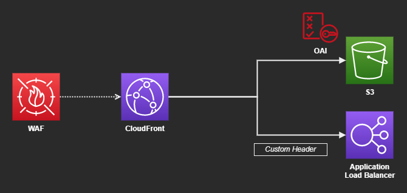
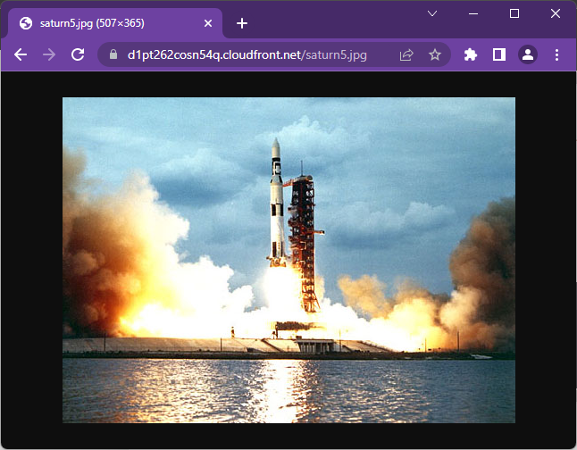

# AWS CloudFront WAF

CloudFront with WAF serving S3 and ELB origins.





## Create the infrastructure

Create the `.auto.tfvars` file:

```sh
touch .auto.tfvars
```

Add the required variables as 

```sh
# The role to be assumed by Terraform to create the resources
assume_role_arn = "arn:aws:iam::000000000000:role/OrganizationAccountAccessRole"

# Region to create the resources
region = "us-east-1"
```

It is required to edit the last LB rule so it fails when the header is not present.

---

### Clean-up

```sh
terraform destroy -auto-approve
```