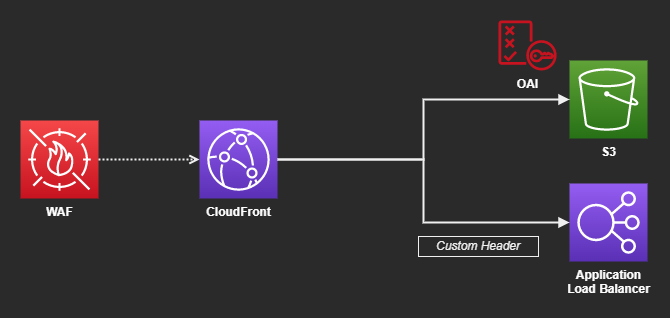
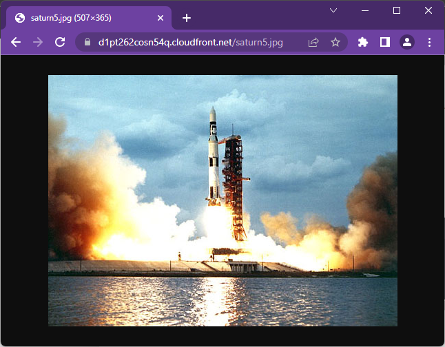
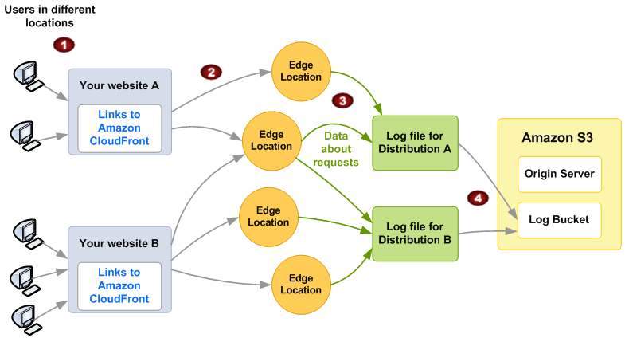

# AWS CloudFront WAF

CloudFront with WAF serving S3 and ELB origins.



## Create the infrastructure

Create the `.auto.tfvars`:

```sh
cp config/template.auto.tfvars .auto.tfvars
```

Apply the infrastructure:

```sh
terraform init
terraform apply -auto-approve
```

Origins will be available for testing:




[Standard logs][1] (access logs) will be enabled by default:




### CloudFront

To [restrict the ELB][2] to accept only CloudFront origins, set the security group to use the managed prefix `com.amazonaws.global.cloudfront.origin-facing`.

```terraform
enable_cloudfront_managed_prefix = true
```

More can be found in the [location for edge servers][3] and [restricting access to load balancer][4].

---

### Clean-up

```sh
terraform destroy -auto-approve
```

[1]: https://docs.aws.amazon.com/AmazonCloudFront/latest/DeveloperGuide/AccessLogs.html
[2]: https://aws.amazon.com/blogs/networking-and-content-delivery/limit-access-to-your-origins-using-the-aws-managed-prefix-list-for-amazon-cloudfront/
[3]: https://docs.aws.amazon.com/AmazonCloudFront/latest/DeveloperGuide/LocationsOfEdgeServers.html
[4]: https://docs.aws.amazon.com/AmazonCloudFront/latest/DeveloperGuide/restrict-access-to-load-balancer.html
