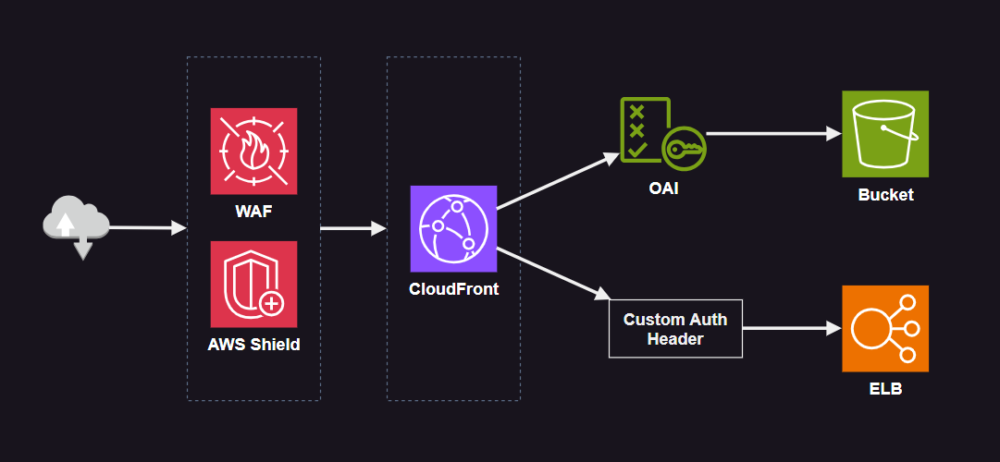

# AWS CloudFront WAF

CloudFront with WAF serving S3 and ELB origins.



## Create the infrastructure

Create the `.auto.tfvars`:

```terraform
waf_country_codes = ["US", "BR"]
waf_rate_limit    = 1000
```

Apply the infrastructure:

```sh
terraform init
terraform apply -auto-approve
```

It is required to edit the last LB rule so it fails when the header is not present.


---

### Clean-up

```sh
terraform destroy -auto-approve
```